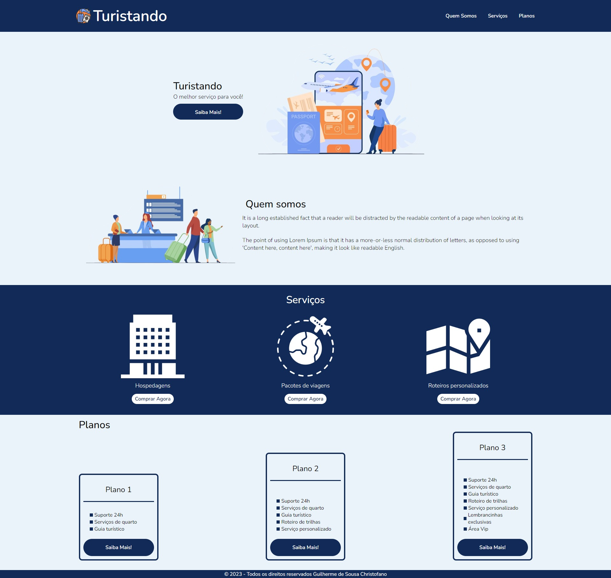

# Turistando 

Esta é um projeto desenvolvido a partir do [curso de Flexbox em CSS](https://web.dio.me/course/posicionando-elementos-com-flexbox-em-css/learning/46f1e8c7-ef6e-458e-ad4e-369fc65faba7). O projeto proposto pela [Karen Santos](https://www.linkedin.com/in/karenasantos/) me ajudou a melhorar minhas habilidades de codificação criando uma landing page realista e responsiva utilizando propriedades de Flexbox. 
    
## Índice

- [Visão geral](#visao-geral)
  - [Captura de tela](#captura-de-tela)
  - [Links](#links)
- [Meu processo](#meu-processo)
  - [Construído com](#construido-com)
- [Autor](#autor)
- [Agradecimentos](#agradecimentos)

## Visão geral

### Captura de tela

### Links

- URL da solução: [GitHub](https://github.com/Gschristofano/Landing-Page-Turistando)
- Live Site URL: [Netlify](https://goturistando.netlify.app/)

## Meu processo

### Construído com
    
- Marcação semântica HTML5
- Propriedades personalizadas do CSS
- Flexbox
- Pseudo-classe
    
## Autor

 

- LinkedIn - [Guilherme S. Christofano](https://www.linkedin.com/in/guilherme-christofano/)

## Agradecimentos

Como de costume, agradeço aos meus amigos e desenvolvedores [Gustavo Maisatto](https://github.com/gustavomaisatto) e [Fabio Pecora Lopes](https://www.linkedin.com/in/fabio-dominicheli-pecora-lopes/) por sempre me encorajar a solucionar problemas e desafios front-end, a [Karen Santos](https://www.linkedin.com/in/karenasantos) pela proposta de projeto do [Curso de Flexbox](https://web.dio.me/course/posicionando-elementos-com-flexbox-em-css/learning/46f1e8c7-ef6e-458e-ad4e-369fc65faba7) e por ultimo, mas não menos importante, aos meus professores e colegas de universidade.
Obrigado!
